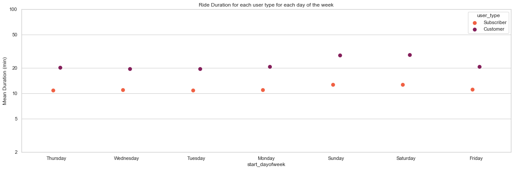

# DataAnalysisND-P03
Udacity Data Analysis Nanodegree Communicate Data Findings Project

# Overview:
I used the BayWheel [Ford GoBike] Dataset for my analysis
The dataset portion used for this analysis is 12 CSV files for each month in 2019.

# Dataset:
Bay Wheels (previously known as Ford GoBike) is a regional public bike-sharing system in the San Francisco Bay Area, California.
Bay Wheels is the first regional and large-scale bicycle sharing system deployed in California and on the West Coast of the United States with nearly 500,000 rides since the launch in 2017 and had about 10,000 annual subscribers as of January 2018.

# Some Observations:
- Riders count dosn't change depending on the day of month.

- Riders prefer to start at 17, 8, 18 and 9 consecutively when it comes to the hour of the day.

- Overall riders number decreases during weekends.

- March and July are the most busy months followed by April and October.

- User Types and access methods are distributed like this:

- Diging deeper, Customers are almost the same throughout days of week but subscribers are the riders who skip during weekends.

- Customers tend to spend more time riding than subscribers.

- Deeper into hours, customers prefer to start late than usual in weekends.

- I don't know why, but many subscribers seem to stop in december and fewer in November meanwhile Customers numbers increases in December.

- Duration almost constant throughout the week for both user types with slight increase in weekends also for both types.

That's it,
Thank You
